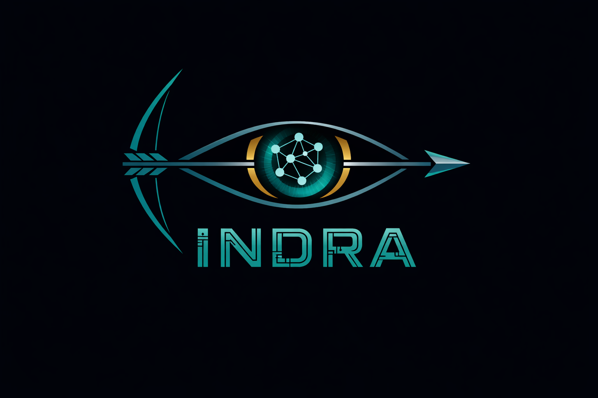
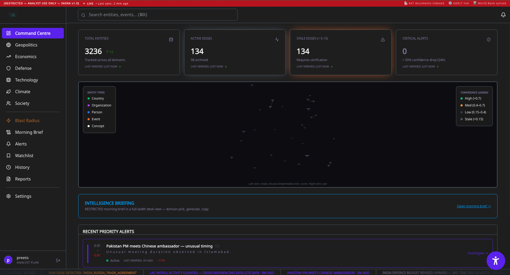
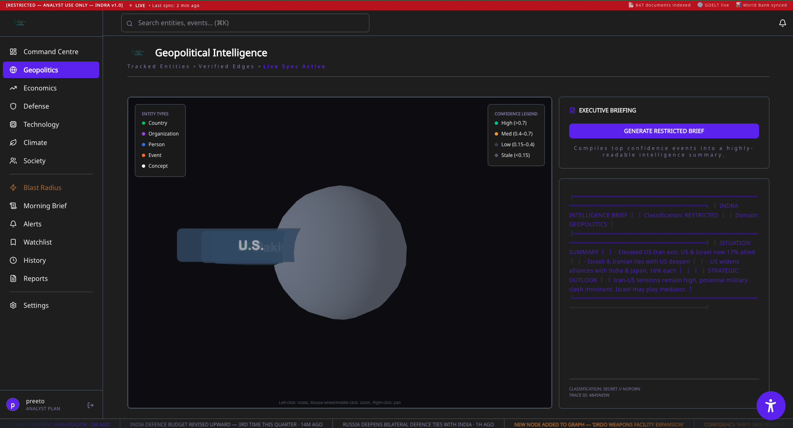
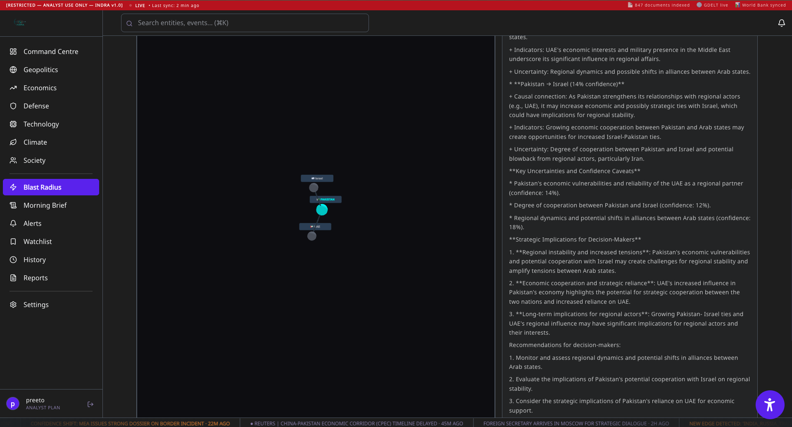
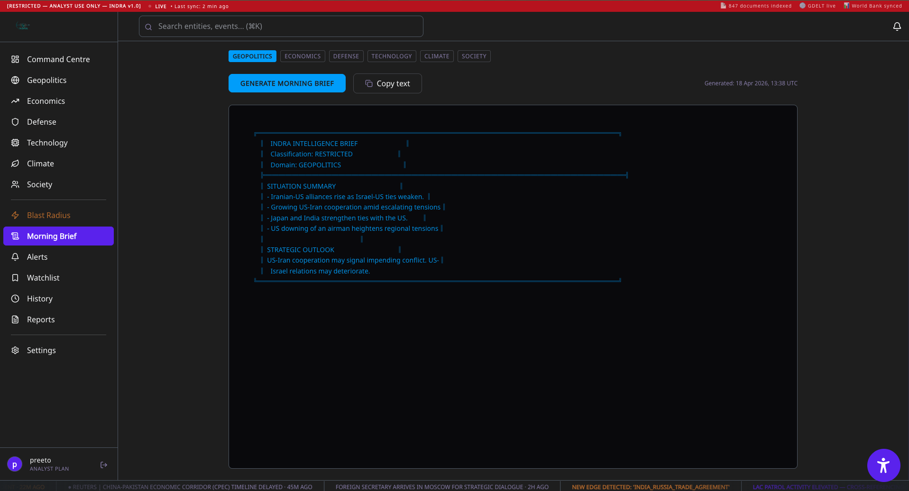
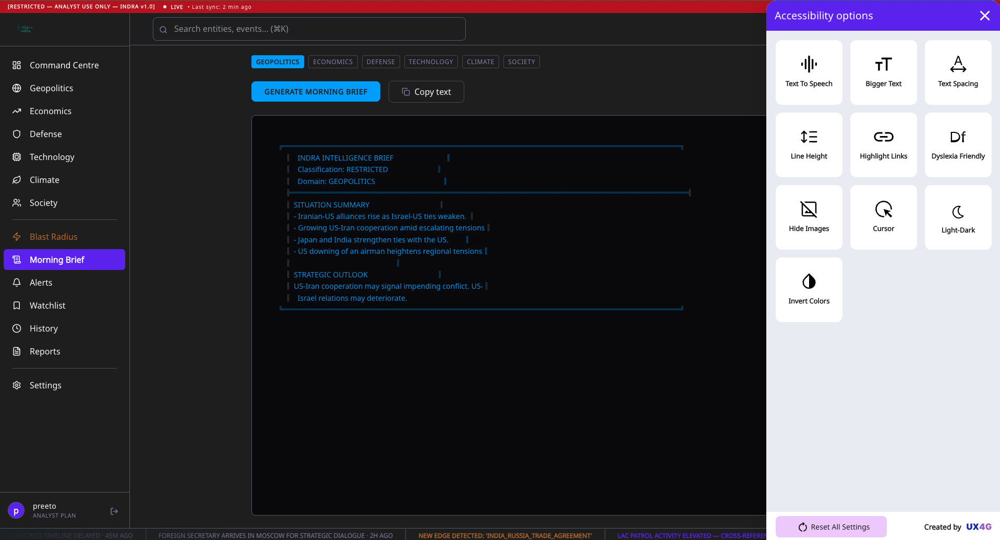

<div align="center">
  

  <h1>INDRA – Intelligence Graph</h1>
  <p><strong>Autonomous Geopolitical Analysis Engine</strong></p>

  <p>
    <a href="https://github.com/achiit/indra/stargazers"></a>
    <a href="https://github.com/achiit/indra/network/members"></a>
    <a href="https://github.com/achiit/indra/issues"></a>
    <a href="LICENSE"></a>
  </p>

  > *"See the connections. Before they connect."*
</div>

<br />

INDRA is a highly-advanced Graph-RAG intelligence system that **autonomously ingests geopolitical news** from dynamic sources including GDELT, PIB, MEA, ORF, and The Hindu. It automatically structures this unorganized data into a dense knowledge graph, enabling defense analysts and researchers to query the state of global affairs in plain English and receive cited, graph-traversed answers.

---

## 🌟 Key Features

- **Autonomous ETL Pipelines:** Real-time synchronization leveraging NLP algorithms to derive entity-relation schemas on-the-fly.
- **Blast Radius Analysis:** Causal path rendering, joint probability math, and maximum-depth graph traversal to predict geometric geopolitical ripples.
- **Graph-RAG Answers:** Integrates high-performance vector search combined with Graph Machine Learning techniques for optimal context synthesis.
- **Domain Alerts:** Active state tracking with a dynamically decaying subgraph architecture to prune stale geopolitical assumptions and surface rapid alerts.
- **Immersive War Room UI:** Interactive 2D/3D knowledge graph, domain panels, interactive Q&A prompts, and robust visualization modules powered by React 18 & Framer Motion.

---

## 📸 Platform Showcase

Here is a glimpse into the professional-grade INDRA platform interface:

<div align="center">

### Authentication & Entry


### War Room & Graph Representation



### Intelligence Analytics & Causal Traversal




</div>

---

## 🏗 System Architecture

The ecosystem relies on an integrated duality between heavy-compute NLP pipelines and high-framerate immersive browser visualizations.

- **Frontend:** React 18, Vite, TypeScript, Tailwind CSS, shadcn/ui, Framer Motion, Recharts, react-force-graph-2d, Zustand.
- **Backend (API):** Python, FastAPI, LightRAG, spaCy, REBEL (Local Models), and Multi-LLM Routing (Gemini/Groq/OpenAI).
- **Database:** Local Network Stores / SQLite embeddings / Postgres routing – managed securely behind API barricades.

```text
LIVE SOURCES          PIPELINE              STORAGE           QUERY
─────────────         ────────              ───────           ─────
GDELT (15min)  ──┐
PIB RSS        ──┤    autonomous_      →   LightRAG      →   Graph-RAG
MEA RSS        ──┤    pipeline.py          knowledge         hybrid query
ORF RSS        ──┤    (dedup +             graph             → cited
NewsData API   ──┘    LLM extract)         (graphml +        answer
                                           vector store)
```

---

## 🚀 Quickstart & Setup Guide

### 1. Backend API (Python FastAPI)

The backend handles machine-learning models, semantic retrieval, and the knowledge graph persistence.

```bash
# Clone the repository
git clone https://github.com/achiit/indra.git
cd indra

# Establish virtual environment
python -m venv venv
source venv/bin/activate       # For Windows: venv\Scripts\activate

# Install core dependencies
pip install -r requirements.txt

# Create .env from template and add your OpenAI and/or NewsData keys
cp .env.example .env

# Launch the FastAPI Core
uvicorn server:app --reload --port 8000
```
*(The backend defaults to port `8000`. You can optionally bootstrap initial graph data by running `python autonomous_pipeline.py bootstrap` in another terminal!)*

### 2. Frontend Interface (Vite + React)

The frontend war-room needs Node.js and npm (or Bun/Yarn). 

```bash
# Navigate to frontend subsystem
cd frontend

# Install Node modules
npm install

# Build & Boot Development Server
npm run dev
```
*(The frontend will automatically bind to `http://localhost:5173` and start listening to API payloads on `8000`. Set `VITE_USE_MOCK=false` inside `frontend/.env.development` if you wish to use live LLM queries instead of the pre-built mock interfaces!)*

---

## 📡 Live Data Sourcing

No manual intervention required. Data is dynamically ingested to synthesize emergent narratives.

| Data Origin       | Contribution Spectrum                     | Sync Lifecycle      | Authorization |
|-------------------|-------------------------------------------|---------------------|---------------|
| **GDELT 2.0**     | Global geopolitical ripples (100+ langs) | Every 15 minutes    | Unrestricted  |
| **PIB Defence**   | Domestic sovereign defence releases      | Real-time RSS       | Unrestricted  |
| **The Hindu**     | Geopolitical journalism & OP-Ed pieces   | Real-time RSS       | Unrestricted  |
| **NewsData.io**   | Rapid-volume article feeds               | Hourly              | Free API Key  |
| **Custom PDFs**   | Classified intelligence report parsing   | On-Demand Uploads   | Local Machine |

---

## ⚖️ License & Ethical Declaration

This platform is distributed under the **[MIT License](LICENSE)** framework.

INDRA is intended for analytical intelligence and geopolitical research enhancement. Please remain mindful of the capabilities generated by autonomous Large Language Models tracing complex networks. **You retain sole jurisdiction over any actions derived from the data presented by this system.** 

---
<div align="center">
  <i>Initiated & Architected by <strong>21Coders | India Innovates 2026</strong>.</i>
</div>
